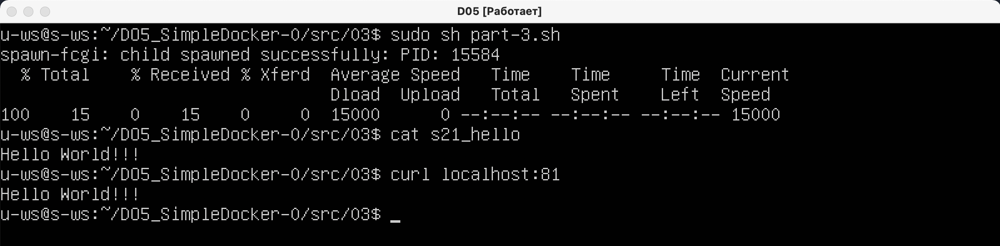

## Part_1 ##

 - Проверка работоспособности докера:

   + Скрипт:

   

   Данный скрипт запускает докер, выводит информацию о контейнере в файл inspect_list, выводит размер и ip-адрес докера, закрывает докер и проверяет его состояние.

   + scripts output and inspect_list - результат работы скрипта и информация о контейнере:

   

   Видим наличие образов, id нужного образа (nginx), наличие запущенного образа (после его запуска - графы created и status), ip-адрес и размер, отсутствие запущенных образов (после остановки). Так - же, из файла inspect_list выбраны строки с портами, размером и ip-адресом.

  - Маппинг портов:

   

   Запуск контейнера с замапленными портами, запрос страницы localhost:80 и её вывод.

  - Restart:

   

   Перезапуск контейнера с проверкой состояния. Обратить внимание на разницу в колонках created и status.

## Part_2 ##

  - Запуск контейнера и копирование конфигурационного файла:
   
   

  - Default config file:

   

  - New config file:

   

  - Copy new config into docker and restart nginx:

   

  - Check status:

   

  - Export container and stop:

   

  - Delete all containers and image nginx:

   

   

  - Import new image and run it:

   

  - Check new nginx status:

   

## Part_3 ##

Все необходимые для данного пункта файлы лежат в папке 03.

 - Скрипт part-3.sh выполняет все необходимые действия:
   
   

 - Результат работы скрипта:

  

## Part_4 ##

Все необходимые для данного пункта файлы лежат в папке 04.

 - Скрипт, удаляющий все контейнеры и образы, и результат его работы:

  

  

 - Cкрипт для создания нового образа (на основе nginx) и запуска контейнера, а также, результат его работы:

  

  

## Part_5 ##

 - Скрипт для установки Dockle:

  

 - Хвост ошибок первой версии Dockerfile:

  

 - Проверка новой версии Dockerfile:

  

Новая версия Dockerfile лежит в директории src.

## Part_6 ## 

Все необходимые файлы расположены в папке 06.

 - Демонстрация работоспособности:

  

